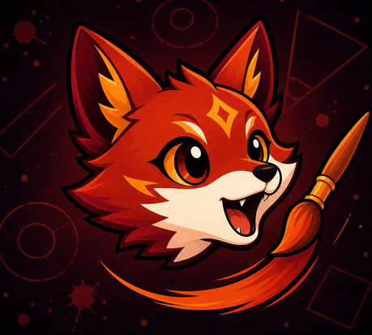
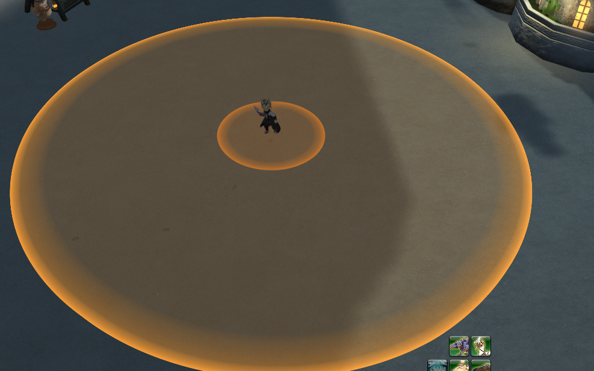
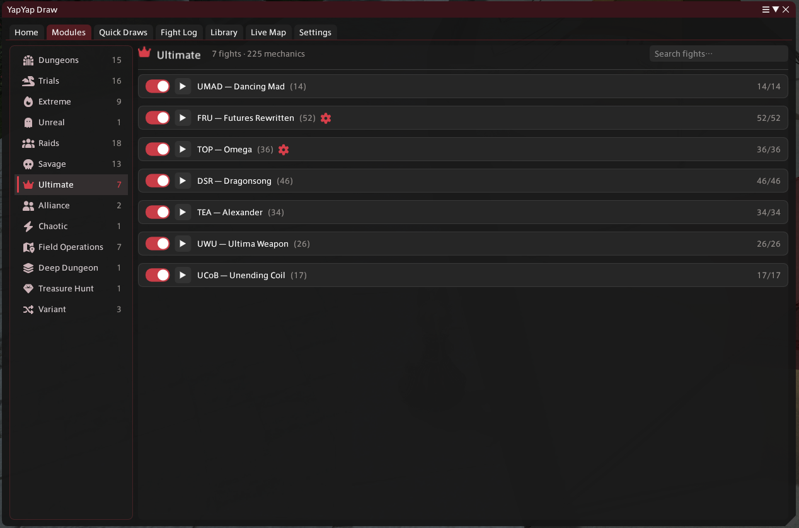
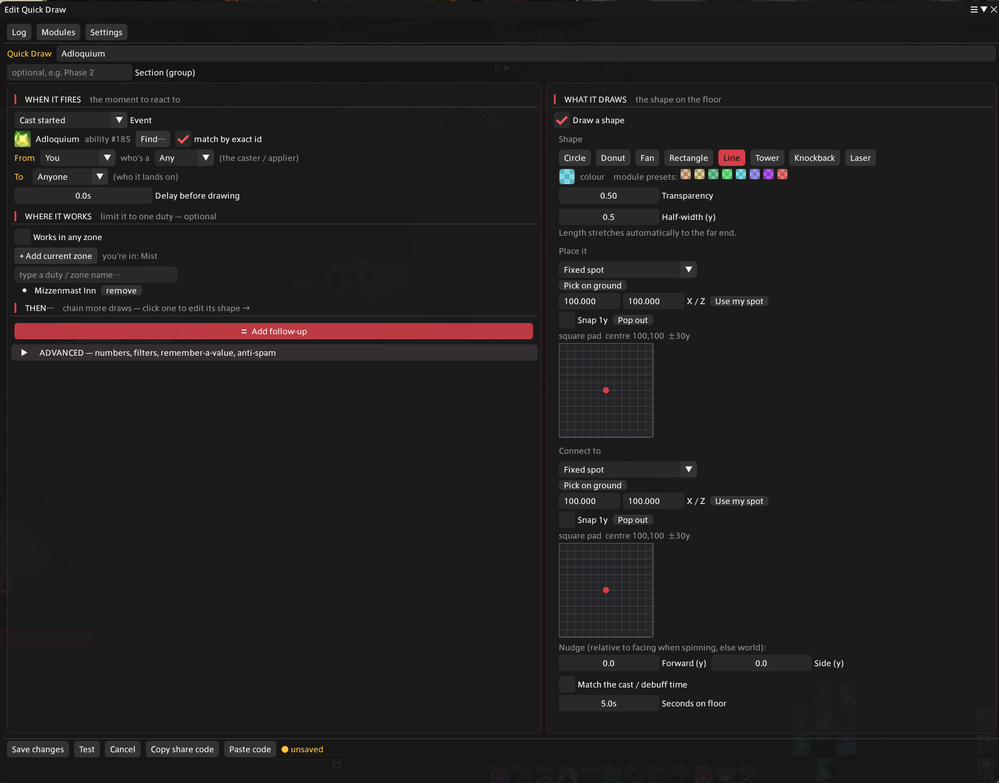

<div align="center">



# YapYap Draw

**Draw your mechanics on the floor.**

A Dalamud plugin for FFXIV that paints boss mechanics onto the arena as they happen, so you react to a shape instead of a cast bar.

</div>



## What it does

YapYap Draw watches the fight through the game's own action and status events, then draws the matching telegraph on the ground: the cone that is about to fire, the safe ring of a donut, the tower you need to soak, the line a tankbuster carves across the arena. It ships with ready made modules for a large list of duties, and it lets you build your own telegraphs without writing any code.

There are three ways to use it:

1. Turn on a prebuilt **module** for the fight you are running.
2. Make your own telegraphs in the **Quick Draw** editor.
3. Watch a fight, read the **Fight Log**, and turn what you see into a draw.

## Installation

Open `/xlsettings`, go to the **Experimental** tab, and add this to **Custom Plugin Repositories**:

```
https://raw.githubusercontent.com/ResFox/YapYapDraw/main/repo.json
```

Save, then open `/xlplugins`, search for **YapYap Draw**, and install.

## Prebuilt modules



The **Modules** tab groups every supported duty by category (Dungeons, Trials, Extreme, Unreal, Raids, Savage, Ultimate, Alliance, Chaotic, Field Operations, Deep Dungeon, Treasure Hunt, Variant). Each fight is a list of individual mechanics you can toggle on or off, so you can keep the dangerous overlaps and hide the ones you already know cold.

Every mechanic mirrors what the source telegraph looks like: shape, radius, length, angle, and the cast that triggers it. Flip a whole fight on with the top toggle, or expand it and pick mechanics one by one. Some fights have extra options behind the gear icon.

## Quick Draws



Quick Draws are your own telegraphs. The editor is split in two: the left side is **when it fires**, the right side is **what it draws**.

**When it fires**
- React to a cast starting or finishing, an ability going off, a status being gained or lost, a headmarker, a tether, or an add spawning.
- Filter by who casts it and who it lands on (you, a party member, the boss, anyone).
- Match an ability by its exact id, add a delay before the shape appears, and limit the draw to a specific duty so it never fires in the wrong place.

**What it draws**
- Shapes: Circle, Donut, Fan, Rectangle, Line, Tower, Knockback, and Laser.
- Pick the colour, transparency, size, and how long it stays on the floor, or match it to the real cast or debuff timer.
- Place it on a fixed spot, on the caster or target, or on a point you pick straight from the ground.
- Chain follow up draws so one trigger can paint a whole sequence.

When a draw is doing what you want, hit **Copy share code** and hand it to a friend. They hit **Paste code** and they have the exact same telegraph.

## Live Map

The **Live Map** tab is a top down view of the arena over the real in game map. It shows every actor with its facing, job icon for players, and a marker shape you can change per type. Waymarks, names, and dead actors are all toggleable, and you can pan and zoom freely.

It also records pulls. Switch to **Replay** to scrub back through a fight frame by frame, watch where everyone stood, and step through the casts that went out. The replay loads the map of the zone it was recorded in, even if you are standing somewhere else.

## Fight Log

The **Fight Log** is the raw event feed: start and end casts, abilities, status gains and losses, tethers, headmarkers, map effects, and deaths, with source, target, positions, and ids. Filter by pull, search by name or id, or click an actor to follow only the events that touch it.

It also exports. **Export** writes a readable text log with per pull relative timings, and **Export JSON** writes a structured dump with everything needed to rebuild a mechanic: action ids, cast times, world positions and facings, targets hit, statuses, tethers, and headmarkers. If you want a module made for a fight, record a clean pull, export the JSON, and send the file.

## Library

The **Library** keeps a catalog of mechanics it has seen you fight. From there you can spin a recorded cast straight into a new Quick Draw, prefilled with the trigger, so you spend your time on the shape instead of hunting for the id.

## Commands

| Command | Action |
| --- | --- |
| `/yd` | open or close the main window |
| `/yd modules` | jump to the Modules tab |
| `/yd map` | jump to the Live Map tab |
| `/yd config` | open settings |
| `/yd clean` | clear every drawn shape on screen |

`/yapdraw` works as the long form of every command.

## Building from source

You need the .NET 9 SDK and a Dalamud dev environment (`%AppData%\XIVLauncher\addon\Hooks\dev`).

```
dotnet build YapYapDraw/YapYapDraw.csproj -c Release
```

The build drops the plugin and a `latest.zip` under `YapYapDraw/bin/Release`.

## Disclaimer

This is a third party plugin and is not affiliated with or endorsed by Square Enix. Use it at your own risk.

## Credits

- Built on [Dalamud](https://github.com/goatcorp/Dalamud).
